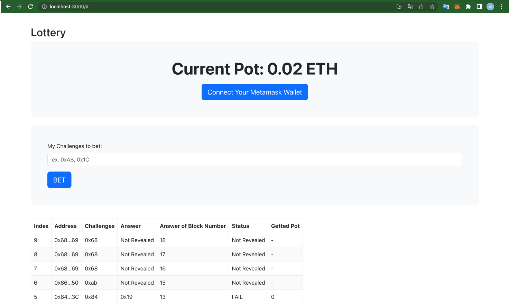
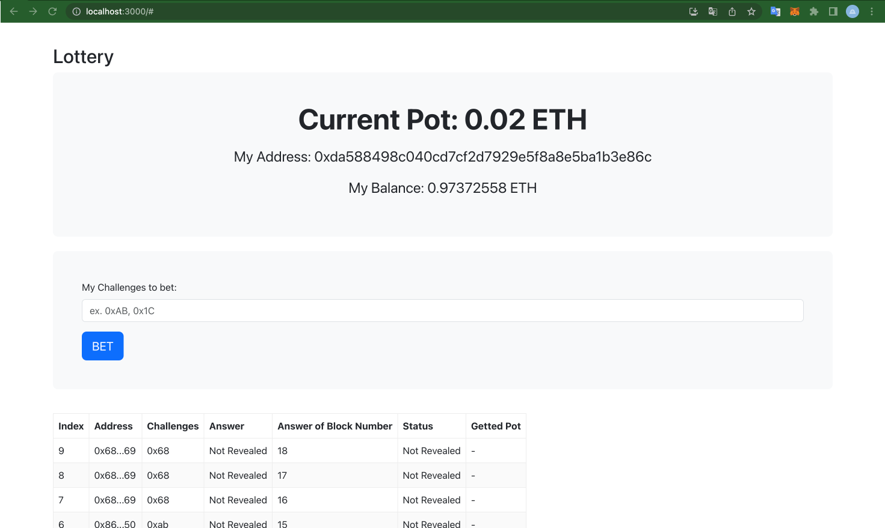

# Lottery-Dapp
This repository is clone-coded for [Infran lecture](https://www.inflearn.com/course/ethereum-dapp/dashboard).
However, I modified the existing code as below:
- Modified the code to match the latest solidity and react versions
- Create tables quickly using react-table
- Previously, challenges could only be selected from a, b, c, and d, but modified to allow all cases

<p align="center">
  
  <figcaption>⬆️ Screen before connecting my account to Metamask</figcaption>
</p>
<p align="center">
  
  <figcaption>⬆️ Screen after connecting my account to Metamask</figcaption>
</p>

## Game Rules
- Match the first two characters of the +3 block hash.
       1. User submits a betting transaction containing information (wage amount, 2 letters).
       2. Compare the value to the block hash of +3 based on the block containing the betting transaction.
- Pot money
       1. Only when the result is obtained, the money transferred from the user will be accumulated in the pot money
       2. If more than one person is guessed, the first person to win wins the pot money.
       3. If only one of the two letters is correct, the transfer will be refunded.
       4. If the result cannot be confirmed, the transferred money will be refunded

## Prerequisite
```
Truffle v5.9.0 (core: 5.9.0)
Ganache v7.8.0
Solidity - 0.6.0 (solc-js)
Node v18.16.0
Web3.js v1.10.0
```
## How to Run
